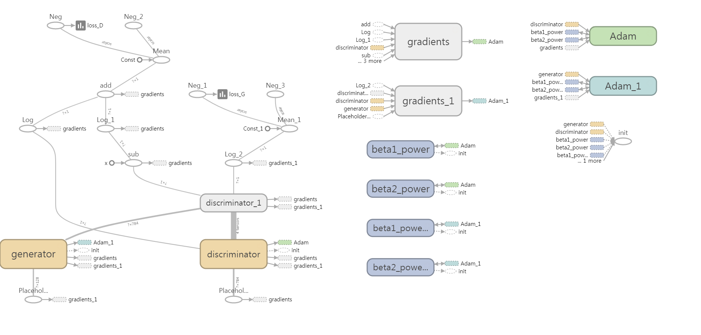
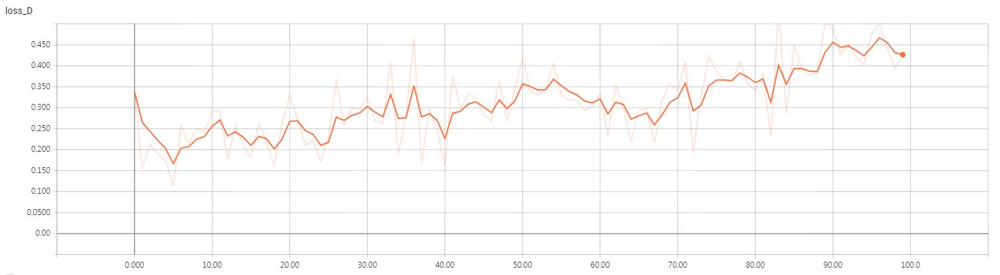
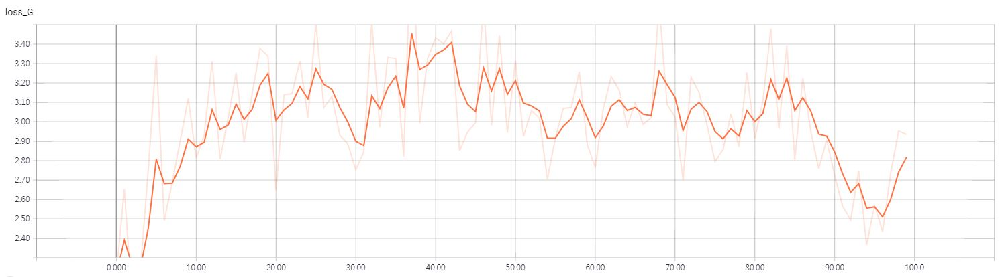
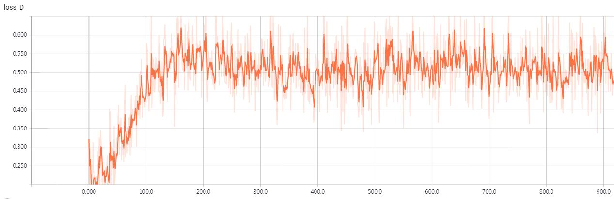
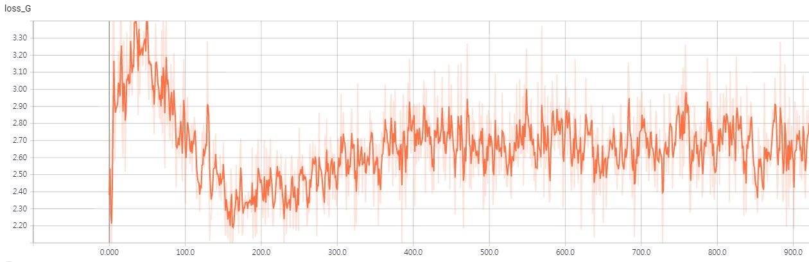
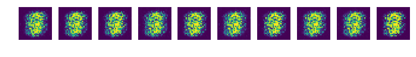
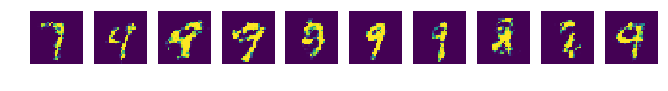
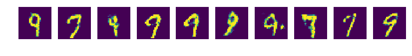
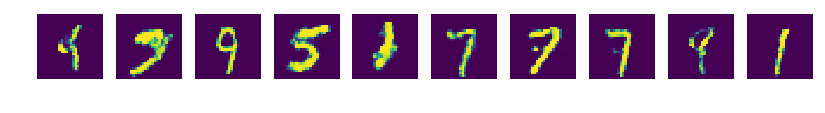
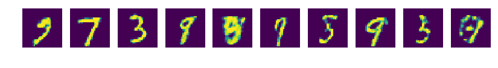

# Vanilla_GAN
Tensorflow implementation of [GAN](https://arxiv.org/abs/1406.2661)

## Requirements
* tensorflow 1.x
* python 3.x

## Core code
```python
def generator(noise_z) :
    with tf.variable_scope('generator') :
        hidden = tf.layers.dense(inputs=noise_z, units=n_hidden, activation=tf.nn.relu)
        output = tf.layers.dense(inputs=hidden, units=n_input, activation=tf.nn.sigmoid)

    return output

def discriminator(inputs, reuse=None) :
    with tf.variable_scope('discriminator') as scope:
        # In order to make the variables of the models that discriminate the actual image from the images generated by the noise the same,
        # Reuse the previously used variables.

        if reuse :
            scope.reuse_variables()

        hidden = tf.layers.dense(inputs=inputs, units=n_hidden, activation=tf.nn.relu)
        output = tf.layers.dense(inputs=hidden, units=1, activation=tf.nn.sigmoid)

    return output

def get_noise(batch_size, n_noise) :
    return np.random.normal(size=(batch_size, n_noise))
```


## Model


```python
loss_D = tf.reduce_mean(tf.log(D_real) + tf.log(1 - D_gene))
loss_G = tf.reduce_mean(tf.log(D_gene))
```
## Training details (epoch < 100)
### loss_D


### loss_G


## Training details (epoch < 1000)
### loss_D


### loss_G


*Even though each of loss_D and loss_G are maximized, loss_D and loss_G are related to each other, so the two loss values will not always tend to increase together.*

*If loss_D increases, loss_G should decrease, and if loss_G increases, loss_D should decrease.*

*Because it is an adversarial relationship.*

## Results
### epoch=0


### epoch=100


### epoch=300


### epoch=600


### epoch=900


## Author
Junho Kim
